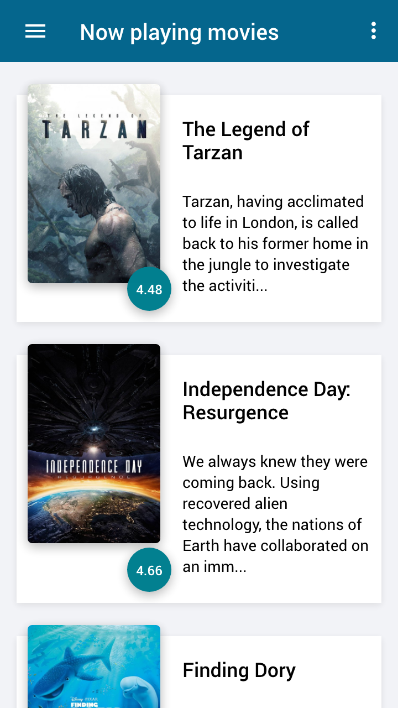
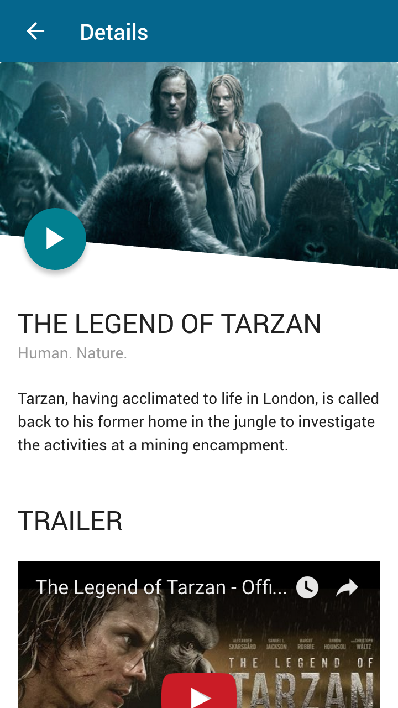

# Ionic 2 - Movie app

This is the demo app with ionic 2 and angular 2. For movie API i used (https://www.themoviedb.org/documentation/api)

For demo preview clone this repo: 
```
https://github.com/kresogalic8/ionic2-movieapp
```

And then execute this command: 

```
ionic serve
```
## Screenshots


Movie list           |  Single movie details
:-------------------------:|:-------------------------:
  |  